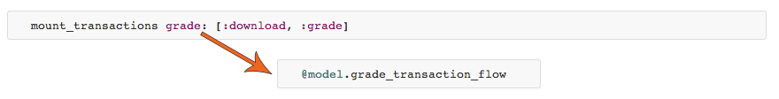

# Ruby on Rails Styleguide

The propose of this document, is show to the new Hello Innovation inmates how we should code our rails apps here. And of course, to remember our old ones too.

## Naming

Use snake_case for methods and variables.

Use CamelCase for classes and modules. (Keep acronyms like HTTP, RFC, XML uppercase.)

Use SCREAMING_SNAKE_CASE for other constants.

The names of predicate methods (methods that return a boolean value) should end in a question mark. (i.e. Array#empty?).

## Controllers

For each request they handle:

```
  session:
    authentication

  session & params:
    access authorization

  params:
    query the database

  params & actions:
    filter params

  actions:
    perform actions
    change session

  actions & response:
    render or redirect

  response:
    associate headers

  after:
    clean up resources (close db transactions)
```

### They shouldn't know about:

- HTML: that's for views/helpers/decorators/presenters
- Caching, that's for views, after the models are loaded
- SQL, that's for Models
- Non-scoped filters: also Models
- Transactional code: that's for Transaction
- 3+ lines of model code: goes inside a Model
- 5+ seconds: send it to background through Transaction
- Ajax actions that check for changes: that's where Publishers come in (websockets)

## Models

If it's not filtering and not saving form fields, then you should probably place it here.

```ruby
  class Post < ActiveRecord::Base
    # concerns
    include Slug
    include URL

    # associations
    has_many :comments, dependent: :destroy

    # validations
    belongs_to :user

    # filters
    def self.by_admins
      where(user: {role: 'admin'})
    end

    # scopes
    scope :by_admins, -> { where(user: {role: 'admin'}) }
    scope :by_guests, -> { where(user: {role: 'guest'}) }

    # custom methods
    def by_admin?
      user.admin?
    end

    # layers
    mount_uploader :image, PostImageUploader
    mount_publisher
    mount_transactions post: [:download, :api_response]

    # https://github.com/pluginaweek/state_machine#example
    state_machine :state do
      state(:downloading)
      state(:downloaded) { validates_presence_of :downloaded_at, :downloaded_content }
      state(:analyzing)
      state(:analyzed)

      event(:to_downloading) { transition nil          => :downloading }
      event(:to_downloaded)  { transition :downloading => :downloaded  }

      event(:to_analyzing)   { transition :downloaded  => :analyzing   }
      event(:to_analyzed)    { transition :analyzing   => :analyzed    }
    end
  end
```

## Decorators

Decorators/Presenters can be analyzed by NewRelic.

If your Decorators/Presenters don't have private methods, Then you're probably not extracting enough.

## Helpers

Helpers cannot be analyzed by NewRelic

Quick & Dirty abstractions go to Helpers
Quality abstractions with objects involved go to Decorators/Presenters

```ruby
  # good to go!
  def dispatcher_route
    controller_name = controller_path.gsub(/\//, "_")
    "#{controller_name}##{action_name}"
  end
```

## Lib

Every class/module that cannot be grouped.
Monkey-patches too.

## Publishers

Simply mount the publisher class from the model class. Then subscribe from the view.

#### app/views/chat_rooms/show.html.erb

```erb
  <script type="text/javascript" src="<%= @chat_room.publisher.url %>/client.js"></script>
  <script type="text/javascript">
    faye = new Faye.Client('<%= @chat_room.publisher.url %>');
    faye.subscribe('<%= @chat_room.publisher.channel %>', chatRoomSubscribeHandler);
  </script>
```

#### app/assets/javascripts/chat_rooms.js

```javascript
  var chatRoomSubscribeHandler = function(data) {
    if (data.action === "text") {

      var text = data.user_id + " says: " + data.text;
      $("#chat").append("<p>" + text + "</p>");

    } elseif if (data.action === "typing") {

      $("#users .user_"+data.user_id).removeClass("typing").addClass("typing");

    } elseif if (data.action === "not_typing") {

      $("#users .user_"+data.user_id).removeClass("typing");

    } else {

      alert( "user: " + data.user_id + " performed an unknown action: " + data.action );

    }

  };
```

#### app/models/chat_room.rb

```ruby
  class ChatRoom
    mount_publisher
  end
```

#### app/publishers/chat_room_publisher.rb

```ruby
  class ChatRoomPublisher < Publisher::Model

    def text!
      publish! action: "text", text: model.text, user_id: model.user_id
    end

    def typing!
      publish! action: "typing", user_id: model.user_id
    end

    def not_typing!
      publish! action: "not_typing", user_id: model.user_id
    end

  end
```

## Transactions

Every transaction should be done here.

If it's a long time spend transaction, should be sent to a background process.

So, in the model you should mount your transaction like that:

```ruby
  mount_transactions grade: [:download, :grade]
```

The mount_transactions grade: generates a method called @model.grade_transaction_flow, which is an alias to the first transaction in the chain, in this case, @model.grade_transaction_flow is an alias to @model.download_transaction



There is two ways to invoke this method in the model.
If it's a fast transaction you can simply run it:

```ruby
  site_transaction_flow.run!
```

Or, if it's a long time spend process you should send it to background, just like that:

```ruby
  site_transaction_flow.to_background
```

The symbols :download and :grade expect that files exist.
app/transactions/grade_report/download_transaction.rb
app/transactions/grade_report/grade_transaction.rb

```ruby
  # app/transactions/grade_report/download_transaction.rb

  class GradeReport < ActiveRecord::Base
    class DownloadTransaction < HelloTransaction::Model

      def before_event
        :to_downloading!
      end

      def after_event
        :to_downloaded!
      end

      def after_background
        model.grade_transaction.to_background
      end

      # invoke this from outside with "run!" or "to_background"
      def _run!
        update_html!
      end

      private

        def update_html!
          url = model.site.url
          model.html = try_html(url)
          model.save!
        end

    end
  end

```

#### Benchmark (optional)

You can add a column with `#{transaction_name}_seconds` to the given model.
Do it generating a migration like that:

```ruby
  class AddBenchMarkToTransactions < ActiveRecord::Migration
    def change
      add_column :grade_reports, :download_seconds, :integer, default: 0
      add_column :grade_reports, :grade_seconds, :integer, default: 0
    end
  end
```

## Uploaders

Uploaders can be generated by [carrierwave](https://github.com/carrierwaveuploader/carrierwave).

```ruby
  class SiteImageUploader < CarrierWave::Uploader::Base
    include CarrierWave::RMagick

    storage :file

    def store_dir
      "uploads/#{Rails.env}/#{model.class.to_s.underscore}/#{model.id}/"
    end

    version :comparison do
      process resize_to_fill: [1280, 570, Magick::NorthGravity]
    end

    def filename
      "#{mounted_as}.jpg"
    end

  end
```

